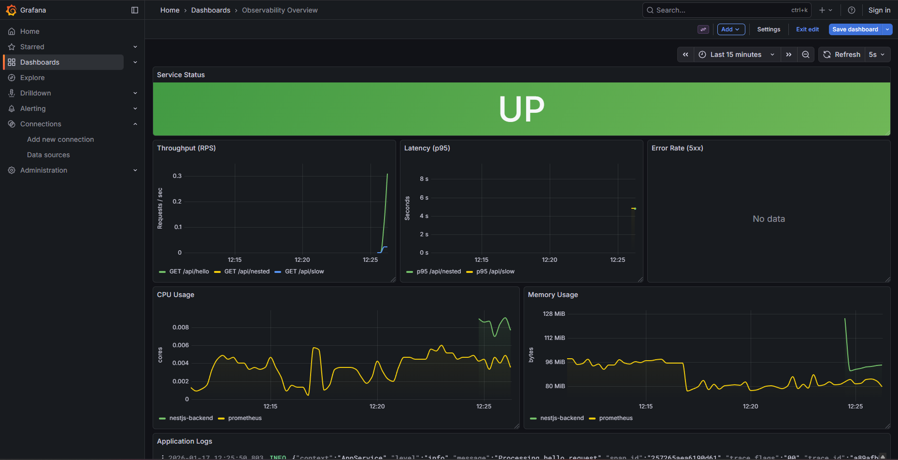
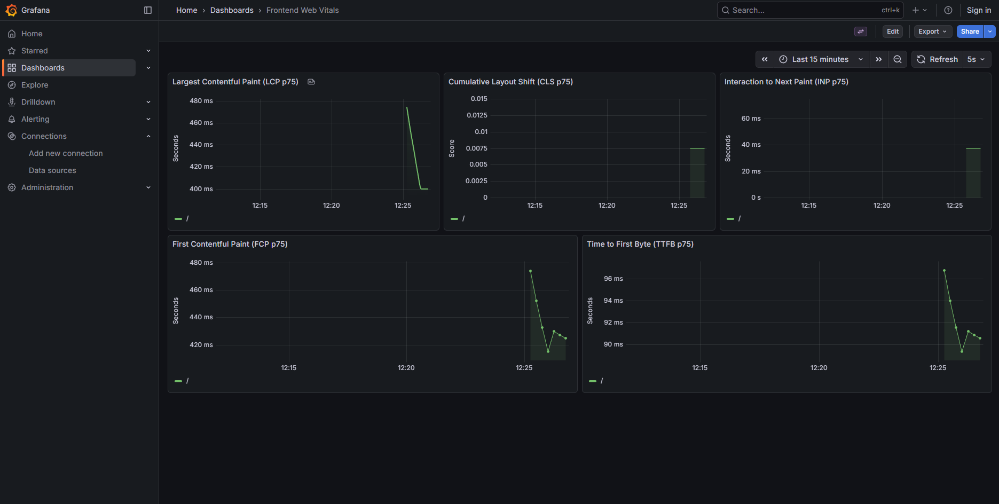
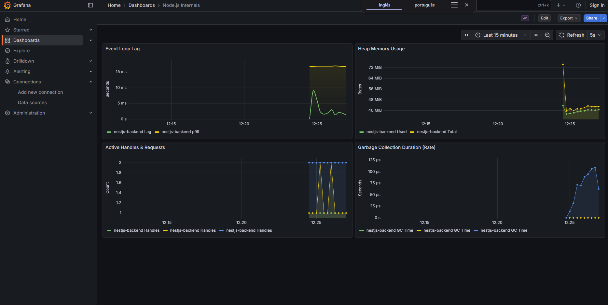

# 🔭 Observability Boilerplate

Full-stack observability template with **Next.js**, **NestJS**, **OpenTelemetry**, **Grafana Tempo**, **Prometheus**, and **Loki**.

## 🎯 Features

- ✅ **Frontend Tracing** - Next.js with OpenTelemetry Web SDK
- ✅ **Backend Tracing** - NestJS with auto-instrumentation
- ✅ **Distributed Tracing** - End-to-end trace correlation
- ✅ **Grafana Tempo** - Trace visualization and analysis
- ✅ **Prometheus** - Metrics collection and monitoring
- ✅ **Grafana Loki** - Log aggregation with trace correlation
- ✅ **Custom Metrics** - Request counters and duration histograms
- ✅ **Structured Logging** - Winston with automatic trace IDs
- ✅ **Sampling** - Configured for production (10% frontend, 20% backend)
- ✅ **Grafana Dashboard** - Pre-configured "Observability Overview"
- ✅ **Modern UI** - Premium design with glassmorphism effects

## � Screenshots

### Distributed Tracing in Grafana Tempo


### Frontend Dashboard


### Backend Dashboard



## �📁 Project Structure

```
boilerplate-observability-node/
├── apps/
│   ├── web/          # Next.js frontend (port 3002)
│   └── api/          # NestJS backend (port 3001)
├── infra/
│   └── docker/       # Grafana + Tempo
└── notas.txt         # Implementation notes (Portuguese)
```

## 🚀 Quick Start

### 1. Start Observability Stack

```bash
cd infra/docker
docker compose up -d
```

This starts:
- **Grafana** on http://localhost:3000
- **Tempo** on http://localhost:3200
- **Prometheus** on http://localhost:9090
- **OTLP Receiver** on http://localhost:4318

### 2. Start Backend (NestJS)

```bash
cd apps/api
npm install
npm run start:dev
```

Backend runs on **http://localhost:3001**

### 3. Start Frontend (Next.js)

```bash
cd apps/web
npm install
npm run dev
```

Frontend runs on **http://localhost:3002**

## 🧪 Testing Observability

1. Open http://localhost:3002
2. Click **"🚀 Simple API Call"** or **"🐌 Slow Operation"**
3. Open Grafana at http://localhost:3000
4. Go to **Explore** → Select **Tempo**
5. Click **"Search"** to see recent traces
6. Click on a trace to see the full distributed trace:
   - Browser → Frontend → Backend → Service → Database

## 📊 What Gets Traced

### Frontend (Next.js)
- ✅ Page loads
- ✅ Fetch/XHR requests
- ✅ Route changes
- ✅ Automatic trace propagation to backend

### Backend (NestJS)
- ✅ HTTP requests
- ✅ Controller methods
- ✅ Service operations
- ✅ Database queries (if configured)
- ✅ Manual spans for custom operations

## 🔧 Configuration

### Frontend Sampling
Edit `apps/web/lib/otel.ts`:
```typescript
sampler: new TraceIdRatioBasedSampler(0.1), // 10%
```

### Backend Sampling
Edit `apps/api/src/otel.ts`:
```typescript
sampler: new TraceIdRatioBasedSampler(0.2), // 20%
```

### OTLP Endpoint
Both apps send traces to:
```
http://localhost:4318/v1/traces
```

## 📦 Tech Stack

| Layer | Technology |
|-------|------------|
| Frontend | Next.js 15 + TypeScript |
| Backend | NestJS + TypeScript |
| Tracing | OpenTelemetry |
| Metrics | Prometheus |
| Visualization | Grafana + Tempo |
| Container | Docker Compose |

## 🎨 API Endpoints

| Endpoint | Description | Duration |
|----------|-------------|----------|
| `GET /api/hello` | Simple response | ~10ms |
| `GET /api/slow` | Slow operation with manual span | 3s |
| `GET /api/nested` | Nested operations with child spans | 2.5s |

## 🧠 Key Concepts

### Trace Propagation
The frontend automatically injects `traceparent` headers in all fetch requests. The backend continues the trace, creating a single distributed trace.

### Sampling
- **Frontend**: 10% (reduce browser overhead)
- **Backend**: 20% (more detailed server traces)

### Manual Spans
See `apps/api/src/app.service.ts` for examples of creating custom spans:

```typescript
const span = this.tracer.startSpan('operation-name');
try {
  span.setAttribute('key', 'value');
  // ... your code
  span.setStatus({ code: 1 }); // OK
} finally {
  span.end();
}
```

## 🔍 Viewing Traces in Grafana

1. **Explore** → **Tempo**
2. **Search** → Click "Run query"
3. Select a trace to see:
   - Timeline view
   - Span details
   - Attributes
   - Service graph

## 📚 Resources

- [OpenTelemetry Docs](https://opentelemetry.io/docs/)
- [Grafana Tempo Docs](https://grafana.com/docs/tempo/latest/)
- [Next.js Docs](https://nextjs.org/docs)
- [NestJS Docs](https://docs.nestjs.com/)

## 🛠️ Troubleshooting

### Traces not appearing?
1. Check if Tempo is running: `docker ps`
2. Check backend logs for OTel initialization
3. Check browser console for frontend OTel logs
4. Verify OTLP endpoint is accessible: `curl http://localhost:4318/v1/traces`

### CORS errors?
Make sure the backend CORS configuration in `apps/api/src/main.ts` allows your frontend origin.

## 📝 License

MIT

---

